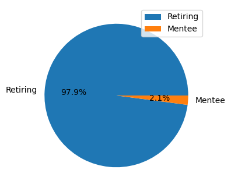

# Pewlett-Hackard-Analysis

## Overview of Project

The purpose of this analysis was to use the SQL to organize and determine the number of employees that were retiring soon. 
After compiling that database, the next step was to figure out all the employees that were eligible for the mentorship Program.    

## Results

The company will be in a lot of troble if it doesn't address the significant amount of employees retiring soon. It was found that:
- The ratio between employess retiring and empolyees possibly entering a mentorship is astounding.
- Two thirds of the retiring staff are senior level employees.
- Only 2 managers are retiring soon. 
- Currently, no managers are in the mentoring program.

Below is simple, but alarming graph. 

## Summary
       
After completing this analysis, there are three things I would recommend the CEO to do to raise profits. First, with urban city types clearly on top for profit,
I would suggest more employees to work the urban areas since you could gain even more profit. Second, this goes along with helping the 1st suggestion,
start moving rural drivers to city areas since the profits are close to 0. Basically you are almost losing money in these areas. My third suggestion would affect suburban and rural areas. I would suggest raising the fares of these areas since the demand isn't as high for urban areas. That way, fewer drivers working these areas will get more for their buck by having only 5 customers for the day as opposed to a city driver with 20 drives a day.
